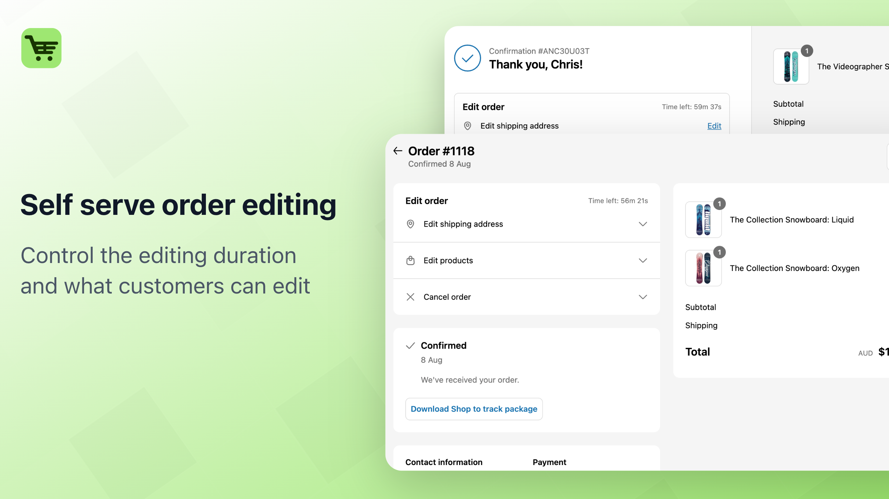

# EasyEdit

### Website of the EasyEdit - Order Editing Shopify app

Let customers edit their own Shopify orders and **save 90% on support tickets** with the easiest order editing app on the market.

EasyEdit empowers customers to modify their own orders, reducing "can you change my order" requests while improving customer satisfaction. Built with modern web technologies for a seamless experience.

[](https://astro.build/)
[](https://tailwindcss.com/)
[](https://apps.shopify.com/easyedit-order-editing)



## Key Features

EasyEdit provides everything you need to streamline order management:

- **Unlimited Order Edits** - Let customers modify their orders freely
- **Analytics Dashboard** - Track editing patterns and customer behavior
- **Easy Onboarding** - 2-minute setup that works with any theme
- **Chat & Email Support** - Professional support when you need it
- **No Hidden Fees** - Transparent pricing based on order volume
- **Custom Edit Windows** - Set time limits for order modifications (Advanced plan)

## 💰 Pricing Plans

EasyEdit offers flexible pricing based on your store's monthly order volume:

- **Basic Plan** - $19/month (0-500 orders) - Perfect for small stores
- **Grow Plan** - $49/month (500-1,500 orders) - Ideal for growing businesses
- **Advanced Plan** - $199/month (1,500+ orders) - Enterprise features included

All plans include:

✅ Unlimited order edits  
✅ Analytics dashboard  
✅ Easy onboarding  
✅ Chat & email support  
✅ No hidden fees  
✅ 30-day free trial

## 🚀 Project Structure

This marketing website is built using Astro.js and Tailwind CSS:

```
src/
├── components/
│   ├── sections/     # Main page sections (Hero, Features, etc.)
│   └── ui/          # Reusable UI components
├── pages/           # Website pages
├── assets/          # Images and static assets
└── config.js        # App configuration and content
```

## 🧞 Commands

All commands are run from the root of the project, from a terminal:

| Command                   | Action                                           |
| :------------------------ | :----------------------------------------------- |
| `npm install`             | Installs dependencies                            |
| `npm run dev`             | Starts local dev server at `localhost:4321`      |
| `npm run build`           | Build your production site to `./dist/`          |
| `npm run preview`         | Preview your build locally, before deploying     |
| `npm run astro ...`       | Run CLI commands like `astro add`, `astro check` |
| `npm run astro -- --help` | Get help using the Astro CLI                     |

## 📱 Get EasyEdit

Ready to reduce your support tickets and improve customer satisfaction?

🔗 **[Install EasyEdit on Shopify App Store](https://apps.shopify.com/easyedit-order-editing)**

- 30-day free trial
- 2-minute setup
- Works with any Shopify theme
- No technical knowledge required

## 🛠️ Development

This website is built with:

- [Astro](https://astro.build) - Static site generator
- [Tailwind CSS](https://tailwindcss.com) - Utility-first CSS framework
- TypeScript for type safety

## 📄 License

This project is licensed under the MIT License - see the [LICENSE](LICENSE) file for details
